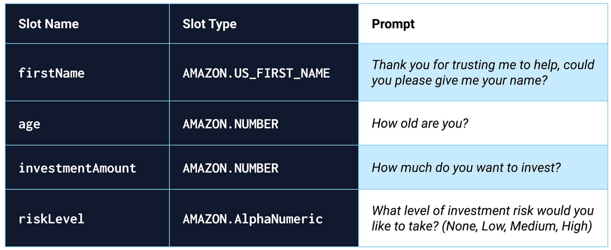
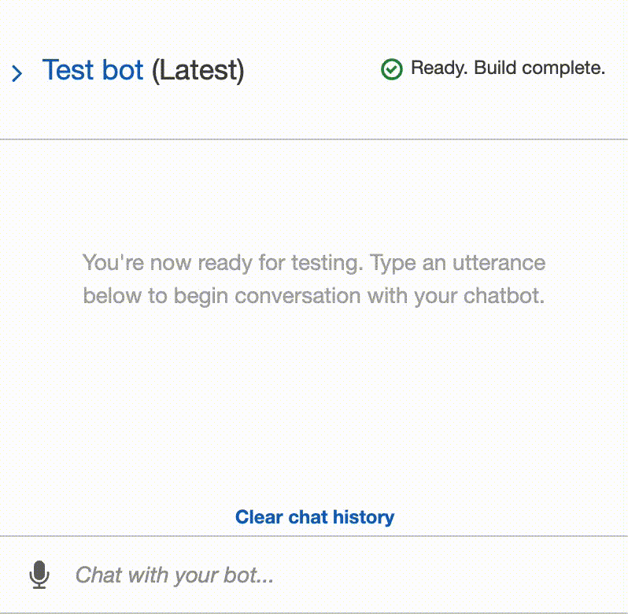
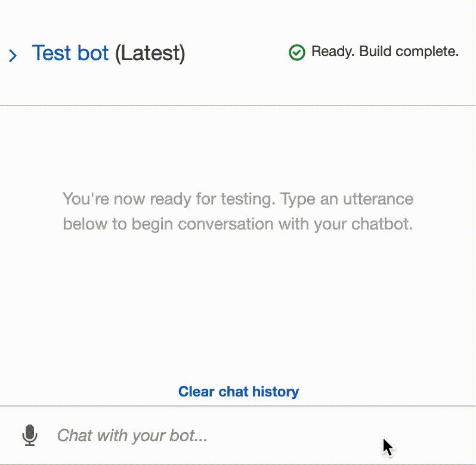

# Robo Advisor for Retirement Planning

Through the use of robo advisors, machine learning and NLP are disrupting finance to improve the customer experience. Retirement-plan providers, who want to increase their client portfolio (especially by engaging young people), are increasingly turning to robo advisors to provide client investment portfolio recommendations for retirement.

The code included in this repo is designed for a retirement provider to offer such advice via a robo advisor to existing and potentially new customers.

---
## Technologies

This repo consists of instructions for building a robo advisor bot in [Amazon Lex](https://us-west-2.console.aws.amazon.com/lex/home?region=us-west-2#bots:), with and without enhancement by [Amazon Lambda](https://us-west-2.console.aws.amazon.com/lambda/home?region=us-west-2#/functions). Consult their respective links for further information regrading both technologies.

Further, the included Python script in this repo (the code for the Lambda enhancement) leverages python 3.7 with the following packages that require no additional installation:

* datetime: module that supplies classes for manipulating dates and times. 
* relativedelta: module designed to be applied to an existing datetime and can replace specific components of that datetime, or represents an interval of time.

---
## Installation Guide

This Installation Guide will guide the reader step-by-step in the configuration of an Amazon Lex bot.

__PART I: Configure the Initial Robo Advisor__

This section creates the robo advisor bot and adds an intent with its corresponding slots by way of the following steps:

(1.) Sign in to your AWS Management Console and create a [new custom Amazon Lex bot](https://us-west-2.console.aws.amazon.com/lex/home?region=us-west-2#bots:) with the following criteria:

* Bot name: RoboAdvisor

* Language: English (US)

* Output voice: Salli

* Session timeout: 5 minutes

* Sentiment analysis: No

* COPPA: No

* Advanced options: No

* All other options: The default value

(2.) Add a new intent, and name it recommendPortfolio.

(3.) Configure sample utterances as follows:

* I want to save money for my retirement

* I'm {age} and I would like to invest for my retirement

* I'm ​{age} and I want to invest for my retirement

* I want the best option to invest for my retirement

* I'm worried about my retirement

* I want to invest for my retirement

* I would like to invest for my retirement

(4.) Create four slots, as the following image specifies:

(5.) Mark all the slots as required.

(6.) Move to the “Confirmation prompt” section, and then set the following messages: 

* *Confirm: Thanks, now I will look for the best investment portfolio for you.*

* *Cancel: I will be pleased to assist you in the future.*

__PART II: Build and Test the Robo Advisor__

This section builds and tests the robo advisor by way of the following steps:

(1.) Click the Build button (in the upper-right corner of the page).

(2.) When the build finishes, test it in the “Test bot” pane. The following animation shows a sample test conversation:

__PART III: Enhance the Robo Advisor with an Amazon Lambda Function__ 

This section guides the reader through the addition of the Amazon Lambda functionality to validate the data that a user supplies during a conversation with the robo advisor. 

To enhance your Amazon Lex bot with Lambda, please follow the following steps:

(1.) In the online code editor of Amazon Lambda, delete the AWS-generated default lines of code and paste in the provided lambda_function.py (included in this repo).

(2.) Click on the Deploy button.

(3.) Open the Amazon Lex console and navigate to the recommendPortfolio bot configuration. Integrate the Lambda function into the bot by selecting it in the “Lambda initialization and validation” and “Fulfillment” sections.

(4.) In the “Confirmation prompt” section, uncheck the boxes previously checked in PART I, Step #6 of this installation Guide.

(5.) Click the Build button (in the upper-right corner of the page).

(6.) When the build finishes, test it in the “Test bot” pane. The following animation shows a sample test conversation:

---
## Usage

By adjusting the code in the Lambda script, this Retirement Robo Advisor can be curtailed to custom specifications.

---
## Contributors

Nicole Roberts,
elle.nicole.roberts@gmail.com

---
## License

[BSD 3](https://choosealicense.com/licenses/bsd-3-clause-clear/): BSD 3-clause is a permissive licence, allowing nearly unlimited freedom with the software as long as BSD copyright and license notice is included.